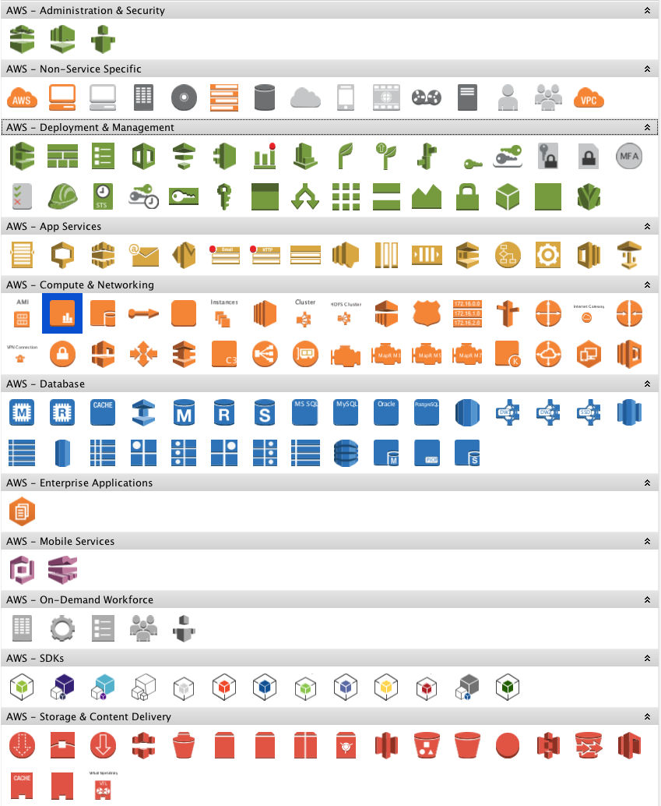

[yED](http://www.yworks.com/en/products/yfiles/yed/) is an awesome diagraming software.

[AWS](https://aws.amazon.com/) is Amazon Web Services. It appears in infrastructure / architecture diagrams.

[AWS Simple Icons](https://aws.amazon.com/architecture/icons/) is an AWS-created icon set for use in architecture diagrams.

You can use "Import Section" in yED as described [here](http://yed.yworks.com/support/manual/palette_manager.html).
